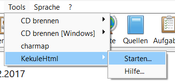

## 🇩🇪 Plugin für Ahnenblatt

Für [Ahnenblatt](https://www.ahnenblatt.de/) gibt es eine Integration als Wrapper-Plugin, so dass KekuleHtml direkt aus Ahnenblatt heraus gestartet werden kann.

### Download

Im [Support Portal für Ahnenblatt](https://www.ahnenblattportal.de/viewtopic.php?t=10671) kann eine fertige Plugin-Version heruntergeladen werden.

### Manuelle Installation

Für eine manuelle Installation müssen die Dateien aus dem aktuellen [Release](https://github.com/LondonRain/KekuleHtml/releases) und die [.abp-Plugin-Datei](https://raw.githubusercontent.com/LondonRain/KekuleHtml/refs/heads/main/AhnenblattPlugin/KekuleHtml.abp) wie folgt in `%USERPROFILE%\Documents\Ahnenblatt\PlugIns` platziert werden.

```
Documents/
├─ Ahnenblatt/
│  ├─ PlugIns/
│  │  ├─ KekuleHtml/
│  │  │  ├─ ...
│  │  │  ├─ KekuleHtmlUi.exe
│  │  │  ├─ [und alle anderen Dateien aus dem Release-Archiv]
│  │  ├─ KekuleHtml.abp
```

### Aufruf

Wenn alles an der richtigen Stelle abgelegt wurde, erscheint „KekuleHtml“ in Ahnenblatt im Menü unter "Extras/KekuleHtml/Start".



---

## 🇬🇧 Plugin for Ahnenblatt

There is an integration for [Ahnenblatt](https://www.ahnenblatt.de/) in the form of a wrapper plugin, so that KekuleHtml can be launched directly from within Ahnenblatt.

### Download

A ready-to-use version of the plugin can be downloaded from the [Ahnenblatt Support Portal](https://www.ahnenblattportal.de/viewtopic.php?t=10671).

### Manual installation

For a manual installation, the files from the latest [release](https://github.com/LondonRain/KekuleHtml/releases) and the [.abp plugin file](https://raw.githubusercontent.com/LondonRain/KekuleHtml/refs/heads/main/AhnenblattPlugin/KekuleHtml.abp) must be placed in `%USERPROFILE%\Documents\Ahnenblatt\PlugIns` as follows.

```
Documents/
├─ Ahnenblatt/
│  ├─ PlugIns/
│  │  ├─ KekuleHtml/
│  │  │  ├─ ...
│  │  │  ├─ KekuleHtmlUi.exe
│  │  │  ├─ [and everything else from the published archive]
│  │  ├─ KekuleHtml.abp
```
### How to use

If everything has been placed in the correct location, ‘KekuleHtml’ will appear in Ahnenblatt under "Tools/KekuleHtml/Start" in the menu.

