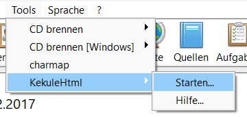
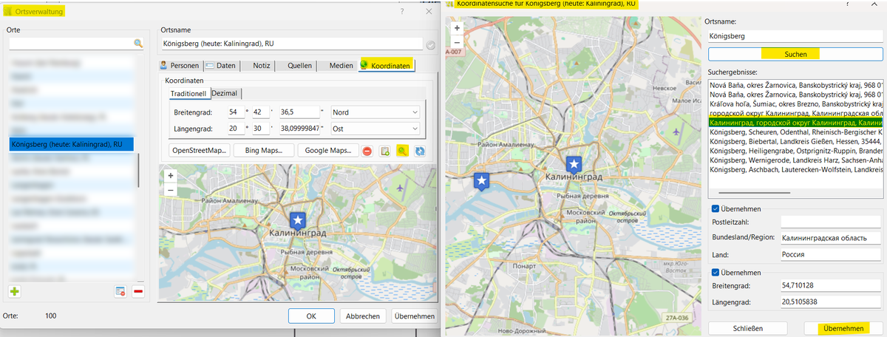

## 🇩🇪 Plugin für Ahnenblatt

Für [Ahnenblatt](https://www.ahnenblatt.de/) gibt es eine Integration als Wrapper-Plugin, so dass KekuleHtml direkt aus Ahnenblatt heraus gestartet werden kann.

### Download

Bei dem aktuellen [Release](https://github.com/LondonRain/KekuleHtml/releases/latest) kann direkt auch eine Plugin-Version für Ahnenblatt heruntergeladen werden.
Im [Support Portal für Ahnenblatt](https://www.ahnenblattportal.de/viewtopic.php?t=10671) gibt es einen Thread, wo Fragen gestellt werden können.

### Installation

Die heruntergeladene Archivdatei mit der Plugin-Version muss - wie alle anderen Ahnenblatt-Plugins auch - entpackt werden und dann unter `%USERPROFILE%\Dokumente\Ahnenblatt\PlugIns` (z.B: `"C:\Benutzer\Max Mustermann\Dokumente\Ahnenblatt\PlugIns"`) platziert werden. Die Ordnerstruktur sieht dann wie folgt aus:

```
Dokumente/
├─ Ahnenblatt/
│  ├─ PlugIns/
│  │  ├─ KekuleHtml/
│  │  │  ├─ ...
│  │  │  ├─ KekuleHtmlUi.exe
│  │  │  ├─ [und alle anderen Dateien aus dem Release-Archiv]
│  │  ├─ KekuleHtml.abp
```

### Aufruf

Wenn alles an der richtigen Stelle abgelegt wurde, erscheint "KekuleHtml" in Ahnenblatt im Menü unter "Extras/KekuleHtml/Start".



### Koordinaten für Kartenfunktionalität

Damit die [Kartenfunktionalität](../README.md#geographische-verteilung-der-ahnenlinien) funktioniert müssen Koordinaten erfasst worden sein. Dies funktioniert in Ahnenblatt über die Ortsverwaltung, die eine Suche nach dem Ortsnamen und die Übernahme der Koordinaten von einer Karte aus unterstützt:


---

## 🇬🇧 Plugin for Ahnenblatt

There is an integration for [Ahnenblatt](https://www.ahnenblatt.de/) in the form of a wrapper plugin, allowing KekuleHtml to be launched directly from within Ahnenblatt.

### Download

With the current [release](https://github.com/LondonRain/KekuleHtml/releases/latest), a plugin version for Ahnenblatt can also be downloaded directly.
There is a thread on the [Ahnenblatt Support Portal](https://www.ahnenblattportal.de/viewtopic.php?t=10671) where you can ask questions.

### Installation

The downloaded archive file containing the plugin version must – like all other Ahnenblatt plugins – be extracted and then placed in `%USERPROFILE%\Documents\Ahnenblatt\PlugIns`. (e.g: `"C:\Users\Max Mustermann\Documents\Ahnenblatt\PlugIns"`) The folder structure will then look as follows:

```
Documents/
├─ Ahnenblatt/
│  ├─ PlugIns/
│  │  ├─ KekuleHtml/
│  │  │  ├─ ...
│  │  │  ├─ KekuleHtmlUi.exe
│  │  │  ├─ [and everything else from the published archive]
│  │  ├─ KekuleHtml.abp
```
### How to use

If everything has been placed in the correct location, "KekuleHtml" will appear in Ahnenblatt under "Tools/KekuleHtml/Start" in the menu.


### Coordinates for map functionality

For the [map functionality](../README.en.md#geographic-distribution-of-ancestral-lines) to work, coordinates must have been entered. In Ahnenblatt, this is done via the manage places feature, which allows you to search for a place name and import coordinates from a map:
