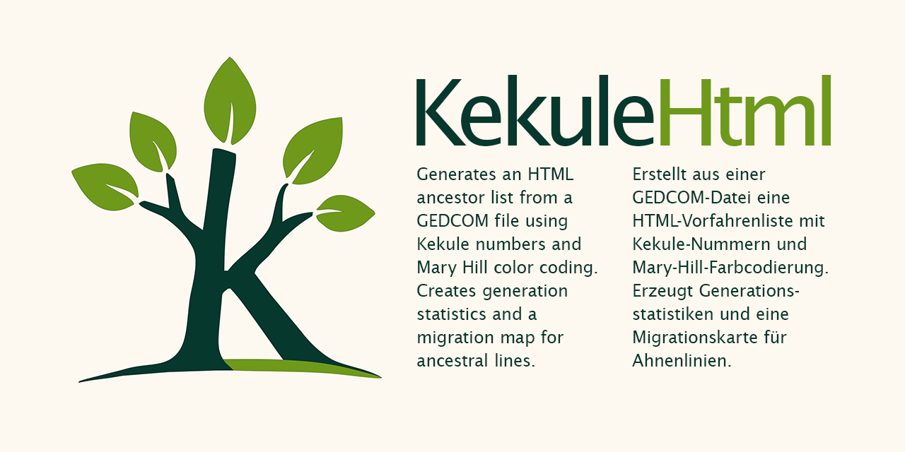
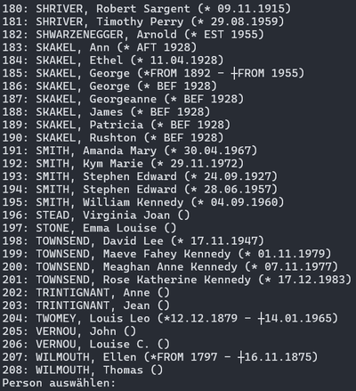
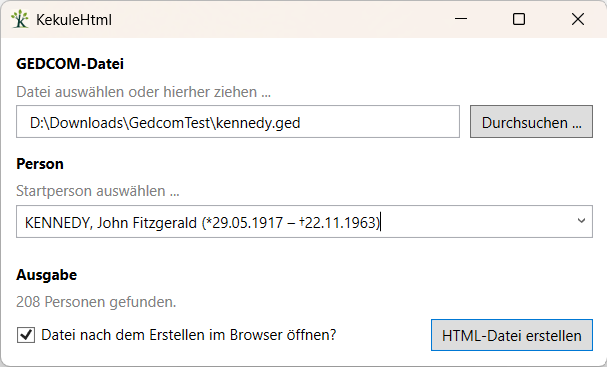
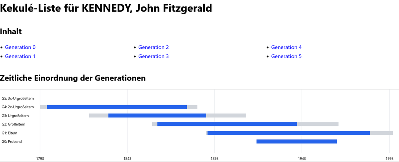
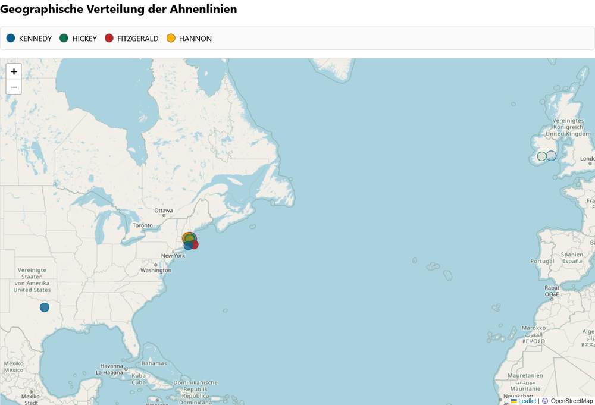
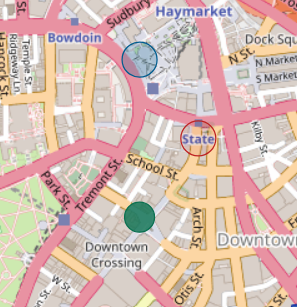
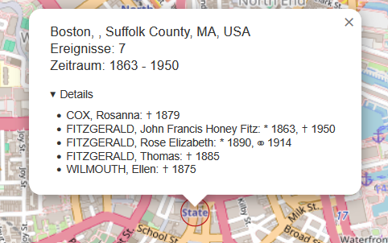
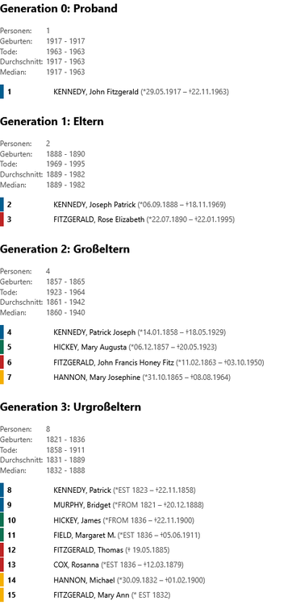

# Einleitung

  

1. [Voraussetzungen](#voraussetzungen)
2. [Aufruf & Oberfläche](#aufruf)
3. [Funktionen](#funktionen)
4. [Abhängigkeiten & Lizenz](#abhängigkeiten)

## Beschreibung

**KekuleHtml** ist entstanden, um persönliche Ahnenforschungsdaten auszuwerten.

Basierend auf einer [GEDCOM](https://de.wikipedia.org/wiki/Gedcom)-Datei erstellt es eine kompakte HTML-Ahnenliste nach [Kekule](https://de.wikipedia.org/wiki/Kekule), die bspw. bei der Orientierung in den eigenen Daten und Verzeichnisstrukturen der Quellen helfen kann.

Zusätzlich erstellt es eine Generationenstatistik und - so dafür Geodaten vorhanden sind - eine Karte, die es erlaubt Migrationsbewegungen über die verschiedenen Generationen und Familienzweige hinweg zu visualisieren.

## Voraussetzungen

- > ℹ️ Die Anwendung basiert auf dem [.NET10-Framework](https://dotnet.microsoft.com/en-us/download/dotnet/10.0). Dieses muss installiert sein. 
- Damit Datumswerte korrekt eingelesen werden können, müssen diese dem [GEDCOM-Standard](https://gedcom.io/specifications/FamilySearchGEDCOMv7.html#date) entsprechen. Bspw. funktionieren keine deutschen Monatsnamen.
- Für die Kartenfunktionalität müssen die Orte georeferenziert worden sein. Eine eigene Georeferenzierung auf Basis der Ortsnamen findet nicht statt. Siehe Abschnitt ["Geographische Verteilung der Ahnenlinien"](#geographische-verteilung-der-ahnenlinien).

## Aufruf

Als Kommandozeilenparameter muss die eigene GEDCOM-Datei angegeben werden:
`KekuleHtml.exe kennedy.ged`

Eine alphabetisch sortierte Liste aller in der Datei existierenden Personen wird ausgegeben. Die Startperson (Kekule-Nummer 0) muss durch Eingabe ihrer vorstehenden Nummer ausgewählt werden.

Anschließend wird im selben Verzeichnis wie die GEDCOM-Datei eine `kekule.html` erzeugt. Diese wird nicht automatisch im Browser geöffnet.

### Oberfläche

Es gibt aber auch eine Bedienoberfläche. Dazu die `KekuleHtmlUi.exe` starten.

Über "Durchsuchen ..." kann eine GEDCOM-Datei ausgewählt werden. Alternativ lässt sich diese per Drag and Drop (etwas aus dem Windows Explorer heraus) auf das Fenster ziehen und so öffnen. Unter "Startperson wählen ..." lässt sich eine Auswahlliste öffnen, um diese festzulegen. Wenn man in das Textfeld tippt wird die Auswahlliste entsprechend gefiltert. Über ein Häkchen lässt sich festlegen, ob die nach einem Klick auf "HTML-Datei erstellen" generierte Datei direkt geöffnet werden soll.

## Funktionen

### Inhalt & Zeitliche Einordnung der Generationen

Es wird ein Inhaltsverzeichnis mit Links zu jeder Generation ausgegeben.

Außerdem wird ein Zeitleistendiagramm erzeugt, welches die Lebensspanne der einzelnen Generationen darstellt. Die grauen Balken gehen vom kleinsten Geburts- bis zum größten Sterbedatum. Gibt es in der Generation nicht bei jeder Person Sterbedaten und ist mindestens eines der Geburtsjahre 110 oder weniger Jahre her, wird angenommen, dass die Generation noch lebt und der Balken erstreckt sich bis ins aktuelle Jahr. Die blauen Balken stellen die jeweilige Zeitspanne vom Median der Geburts- und Sterbejahre dar. Die Balken sind ebenfalls klickbar und springen dann zur Auflistung der jeweiligen Generation.

### Geographische Verteilung der Ahnenlinien

Liegen für Personen geolokalisierte Orte vor ([LATI- und LONG-Tag](https://gedcom.io/specifications/FamilySearchGEDCOMv7.html#latitude) in GEDCOM), so wird eine Karte ausgegeben.

#### Datengrundlage

Als Grundlage der Karte werden für jede Person folgende Ereignisse samt Name, Zeitpunkt, Familienzweig und Ort eingesammelt - wenn ein Ort mit Koordinaten vorhanden ist:
- Geburtsort
- Heiratsort
- Sterbeort
- Wohnorte einer Person
- Wohnorte einer Heirat/Familie

#### Cluster

Diese Punkte werden gesammelt und in Cluster nach Ort und Familienzweig aufgeteilt. Dabei wird von den vier Großeltern aus die Farbkodierung der jeweiligen Familienlinien nach [Mary Hill](http://www.genrootsorganizer.com/p/13-steps.html) verwendet.

Jeder farbliche Punkt auf der Karte stellt eines dieser Cluster dar. Je größer der Kreis, desto mehr Ereignisse haben an dem Ort stattgefunden. Je heller der Kreis desto älter ist das erste dortige Ereignis, je dunkler desto neuer. Die Schattierung nach Ereignisalter ist relativ für jeden der 4 Familienzweige.

Existieren an einem Ort Ereignis-Cluster mehrerer Familienzweige, überlagern sich diese nicht, sondern werden leicht zueinander versetzt dargestellt, wie in folgendem Screenshot ersichtlich.

Ein Klick auf eines der Cluster öffnet ein Popup mit dem Ortsnamen, der Ereignisanzahl und dem Ereigniszeitraum. Unter Details findet sich eine alphabetisch sortierte Liste der dort vorkommenden Personen mit Geburts (*)- und Sterbejahren (✝), Jahr einer Eheschließung (⚭), sowie einer Zeitspanne von wann bis wann sie dort gelebt hat (⌂).

### Kekule-Liste
In der eigentlichen Ahnenliste werden pro Generation alle vorhandenen Personen in einer kompakten Form ausgegeben. Auch hier findet die farbliche Kodierung nach Mary Hill Anwendung.

Pro Generation wird der Zeitraum der vorkommenden Geburten und Todesfälle ausgegeben, außerdem wird jeweils der Durchschnitt und Median der Lebensspanne der Generation berechnet.

## Abhängigkeiten

- **KekuleHtml** nutzt [GeneGenie.Gedcom](https://github.com/TheGeneGenieProject/GeneGenie.Gedcom) zum Parsen der GEDCOM-Datei.
- [Leaflet](https://leafletjs.com/) wird mit [OpenStreetMap.de](https://www.openstreetmap.de/)-Daten zur Kartendarstellung verwendet.
- [Leaflet Control FullScreen](https://github.com/brunob/leaflet.fullscreen) ergänzt einen Vollbildknopf für die Karte.
- Die [Kennedy Family](https://github.com/D-Jeffrey/gedcom-samples/tree/main#kennedy)-Beispiel-GEDCOM-Datei von [gedcom-samples](https://github.com/D-Jeffrey/gedcom-samples) wurde zum Erstellen der Dokumentation genutzt.

Herzlichen Dank an alle!

### Lizenz

Wie [GeneGenie.Gedcom](https://github.com/TheGeneGenieProject/GeneGenie.Gedcom) steht **KekuleHtml** unter der [AGPL 3.0](licence.txt).